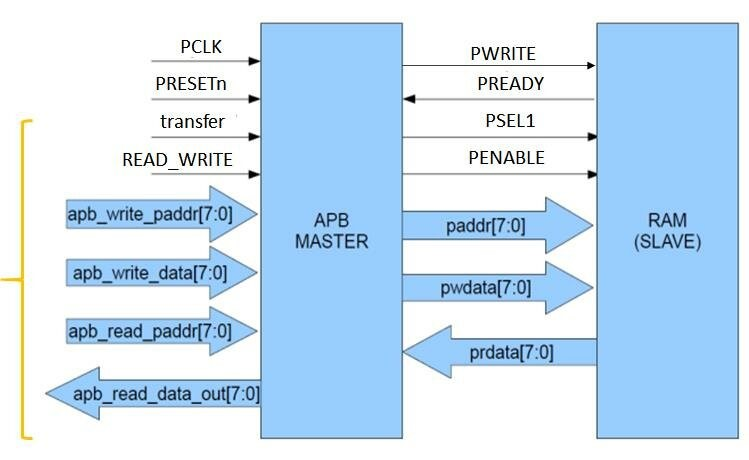
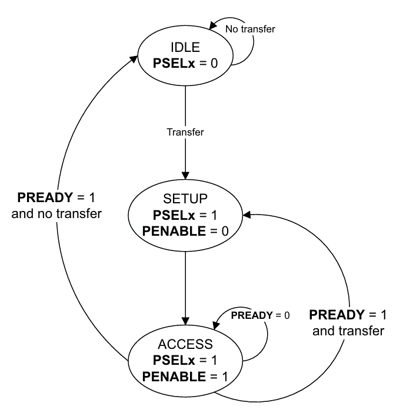
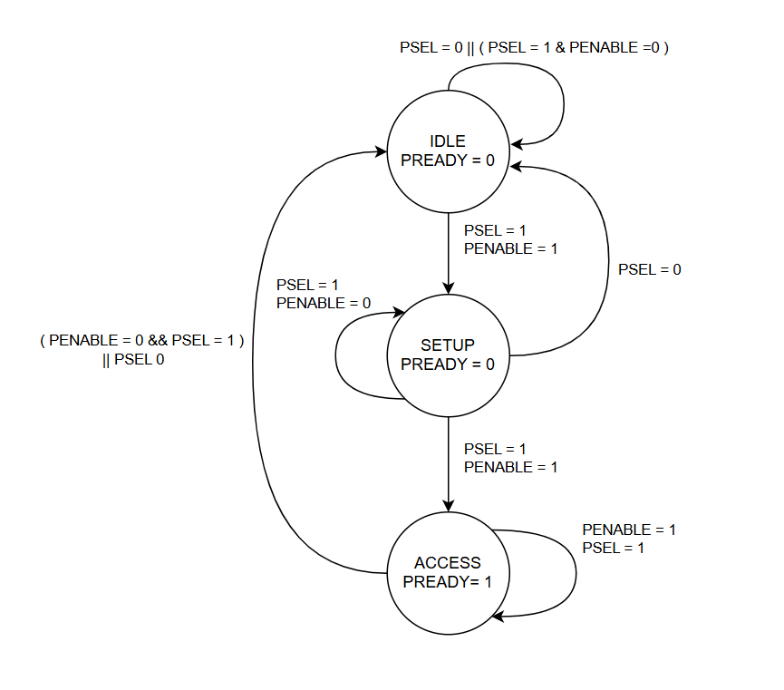

# **Description:** 
The Advanced Peripheral Bus (APB) is a simplified interface used for connecting peripherals to a 
system in embedded systems, particularly in SoCs (System-on-Chip). It is designed for low-bandwidth, 
low-latency communication, making it ideal for simpler, slower peripherals such as timers, UARTs, and 
GPIOs. The APB protocol consists of basic handshaking signals and provides simple, single-cycle access 
to devices. 

---

## **Key Signals**

| Signal   | Description |
|----------|-------------|
| **PADDR** | Address bus for specifying the peripheral address. |
| **PWDATA** | Write data bus to transfer data to peripherals. |
| **PRDATA** | Read data bus to fetch data from peripherals. |
| **PSEL** | Peripheral select signal to indicate the target peripheral. |
| **PWRITE** | Write control signal to determine the operation (write/read). |
| **PENABLE** | Enables the transfer cycle. |
| **PREADY** | Indicates the completion of the operation by the slave. |

---

# **Finite State Machines**

### 1.	Master Interface

### 2.	Slave Interface

# **ABP Protocol Design on Falstad**

